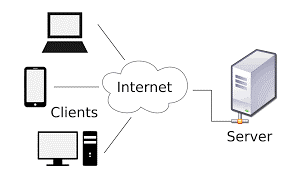
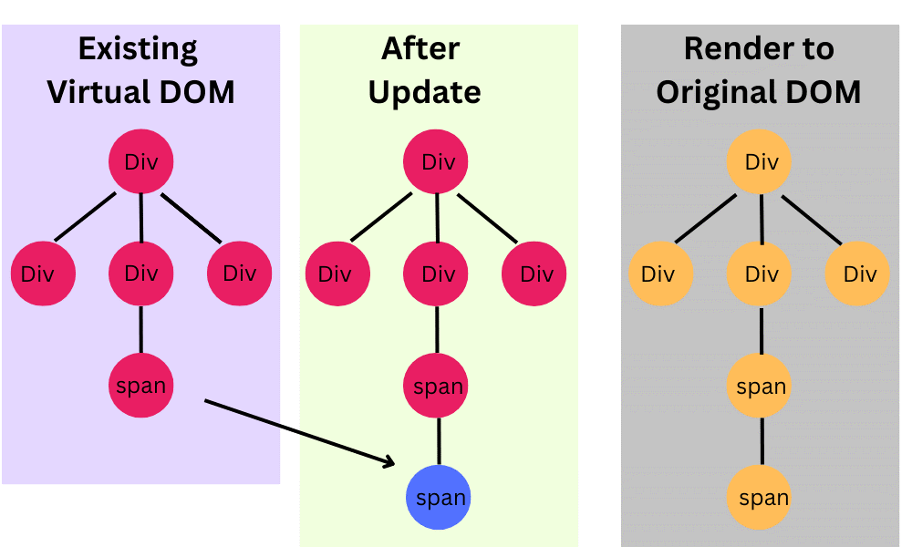

# Class 1: Introduction to React and Vite

In this class we will cover the basics of REACT and Vite JS. We begin by revising how the Web Works.

## 1\. How the Web Works?

### Client-Server Model

The web operates on a client-server model. The client (usually a web browser) sends a request to the server, which processes the request and sends back a response.



**Example:** When you type a URL in your browser, the browser (client) sends a request to the server hosting that website. The server processes the request and sends back the HTML, CSS, and JavaScript files needed to display the website.

## 2\. Traditional Front-End Websites

### Static Websites

These are simple websites with fixed content. They are built using HTML, CSS, and sometimes JavaScript.

**Example:** A portfolio website. A company website.

### Dynamic Websites

These websites can change content dynamically based on user interactions or other factors. They often use JavaScript to manipulate the DOM (Document Object Model).

Example: A blogging website.

## 3\. The DOM (Document Object Model)

### What is the DOM?

First things first, DOM stands for “Document Object Model”. The DOM in simple words represents the UI of your application. Everytime there is a change in the state of your application UI, the DOM gets updated to represent that change. Now the catch is frequently manipulating the DOM affects performance, making it slow.

**Example:** When you click a button on a webpage and the content changes without reloading the page, that’s the DOM being manipulated by JavaScript.

# 4\. Introduction to React

## Background of React

### Who Developed React?

React was developed by Facebook (now Meta) and was first released in 2013. It was created by Jordan Walke, a software engineer at Facebook.

Impact on Web Development:

React introduced a new way of building web applications with a component-based architecture. This approach allows developers to build encapsulated components that manage their own state, making it easier to develop and maintain complex applications.

## What is React?

React is a JavaScript library for building user interfaces. It allows developers to create reusable UI components.

### Why Use React?

Component-Based: Build encapsulated components that manage their own state.

Declarative: React makes it painless to create interactive UIs. Design simple views for each state in your application.

Efficient: React updates and renders the right components when your data changes.

## React DOM

What is React DOM? React DOM is the package that provides DOM-specific methods that enable React to interact with the DOM.

Difference from JS DOM: Unlike the traditional JavaScript DOM, which updates the entire DOM tree, React DOM uses a virtual DOM to optimize updates. The virtual DOM is a lightweight copy of the actual DOM. When changes occur, React updates the virtual DOM first, then compares it with the actual DOM, and only updates the parts that have changed.



## Why React is Robust?

**Virtual DOM:** This makes React very efficient, as it minimizes the number of direct manipulations to the actual DOM.

**Reusability:** Components can be reused across different parts of an application, reducing redundancy and improving maintainability.

**Community and Ecosystem:** React has a large community and a rich ecosystem of libraries and tools, making it a popular choice for building large-scale applications.

# 5\. Create React App (CRA) vs. Vite

## Create React App (CRA)

CRA is a tool to set up a modern web app by running one command. It includes everything you need to build a React app.

**Pros:** Easy to set up, good for beginners.

**Cons:** Can be slow for larger projects due to its build process.

## Vite

Vite is a build tool that aims to provide a faster and leaner development experience for modern web projects.

**Pros:** Faster development server, optimized build process, supports modern JavaScript features.

**Cons:** Slightly more complex setup compared to CRA.

# 6\. Setting Up the Development Environment

## Installing Node.js

Download and install Node.js from [www.nodejs.org](http://www.nodejs.org)

_Verify installation by running node -v and npm -v in your terminal._

## Installing VS Code

Download and install Visual Studio Code from code.visualstudio.com.

_Install useful extensions like ESLint, Prettier, and React snippets._

# 7\. Creating a React Project

## Using Create React App (CRA)

Open your terminal and run:

```
npx create-react-app my-app

Here my-app is the name of your project.

cd my-app

npm start
```


This will create a new React project and start the development server.

## Using Vite

Open your terminal and run:

npm create vite@latest

It will ask few questions and will proceed.

```
cd my-app

npm install

npm run dev

```


This will create a new React project using Vite and start the development server.

# 8\. Vite Project Structure

## Overview of Vite Project Structure

index.html: The main HTML file.

src/: Contains all the source code.

main.jsx: The entry point for the React application.

App.jsx: The main App component.

vite.config.js: Configuration file for Vite.

## Why Use Vite?

**Faster Development:** Vite provides a faster development server with hot module replacement.

**Optimized Build:** Vite uses Rollup for optimized builds, resulting in smaller and faster production bundles.

**Modern Features:** Vite supports modern JavaScript features out of the box.
